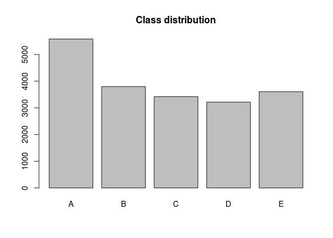
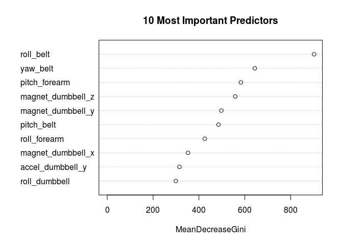

# Weight Lifting Exercises - Correctness Prediction

## Executive summary

This project analyses the data provided in the [Weight Lifting Exercise Dataset](http://groupware.les.inf.puc-rio.br/har) and builds a machine learning model to predict whether the observed subjects performed weight lifts correctly or incorrectly (categorized into five levels from A to E).


## Loading the data

The data files are assumed to be in the working directory.


```r
train.raw <- read.csv('pml-training.csv', na.strings = c('NA', ''), header = TRUE)
test.raw <- read.csv('pml-testing.csv', na.strings = c('NA', ''), header = TRUE)
library(caret)
library(randomForest)
set.seed(666)

barplot(table(train.raw$classe), main = 'Class distribution')
```

 

The distribution of the outcome variable `classe` is reasonably even.

#### Choosing relevant predictors

The model should predict the outcome `classe` (five levels from A to E). Having analyzed the raw data above, we conclude that many columns have missing values (NA or blank). In fact, almost all the values in these columns are missing. Some of these columns contain unnecessary information which can be derived from other columns (like standard deviation and variance). Some columns contain non-numeric data (such as 'user-name', 'new_window', etc.) or information which might not be relevant (such as 'timestamp'). These variables can safely be excluded from the list of potential predictors.

Below is the list of predictors which are usable (the last variable is 'classe' and is the outcome):


```r
## analyze columns
## commented to avoid verbose output
#str(train.raw)

predictors <- c('roll_belt', 'pitch_belt', 'yaw_belt', 'total_accel_belt',
                          'gyros_belt_x', 'gyros_belt_y', 'gyros_belt_z',
                          'accel_belt_x', 'accel_belt_y', 'accel_belt_z',
                          'magnet_belt_x', 'magnet_belt_y', 'magnet_belt_z',
                          'roll_arm', 'pitch_arm', 'yaw_arm', 
                          'gyros_arm_x', 'gyros_arm_y', 'gyros_arm_z', 
                          'accel_arm_x', 'accel_arm_y', 'accel_arm_z',
                          'magnet_arm_x', 'magnet_arm_y', 'magnet_arm_z',
                          'roll_dumbbell', 'pitch_dumbbell', 'yaw_dumbbell',
                          'gyros_dumbbell_x', 'gyros_dumbbell_y', 'gyros_dumbbell_z',
                          'accel_dumbbell_x', 'accel_dumbbell_y', 'accel_dumbbell_z',
                          'magnet_dumbbell_x', 'magnet_dumbbell_y', 'magnet_dumbbell_z',
                          'roll_forearm', 'pitch_forearm', 'yaw_forearm',
                          'gyros_forearm_x', 'gyros_forearm_y', 'gyros_forearm_z',
                          'accel_forearm_x', 'accel_forearm_y', 'accel_forearm_z',
                          'magnet_forearm_x', 'magnet_forearm_y', 'magnet_forearm_z',
                          'classe')

train.raw <- train.raw[,predictors]
test.raw <- test.raw[,predictors[-50]]
```

#### Splitting the training data set into training and cross validation sets

In order to perform cross validation, the training data set is split into two data sets: for training (70% of the data) and validation (30%).


```r
inTrain <- createDataPartition(train.raw$classe, p = 0.7, list = FALSE)
training <- train.raw[inTrain,]
validation <- train.raw[-inTrain,]
```

## Training the prediction model

#### Choosing a model

Taking into account that our data contains 49 predictors, the **Random Forest method** is used, which is particlularly efficient in dealing with a large number of predictors.


```r
modFit <- randomForest(classe ~ ., data = training)
modFit
```

```
## 
## Call:
##  randomForest(formula = classe ~ ., data = training) 
##                Type of random forest: classification
##                      Number of trees: 500
## No. of variables tried at each split: 7
## 
##         OOB estimate of  error rate: 0.46%
## Confusion matrix:
##      A    B    C    D    E class.error
## A 3902    4    0    0    0    0.001024
## B   12 2641    5    0    0    0.006396
## C    0    6 2385    5    0    0.004591
## D    0    0   23 2228    1    0.010657
## E    0    0    2    5 2518    0.002772
```

#### Estimating variable importance


```r
varImpPlot(modFit, n.var = 10, main = '10 Most Important Predictors')
```

 

## Applying the model to the validation set

The model is applied to the validation set in order to check its performance.


```r
predictions <- predict(modFit, validation)
confusionMatrix(predictions, validation$classe)
```

```
## Confusion Matrix and Statistics
## 
##           Reference
## Prediction    A    B    C    D    E
##          A 1673    8    0    0    0
##          B    1 1128    3    0    0
##          C    0    3 1023   10    1
##          D    0    0    0  953    7
##          E    0    0    0    1 1074
## 
## Overall Statistics
##                                         
##                Accuracy : 0.994         
##                  95% CI : (0.992, 0.996)
##     No Information Rate : 0.284         
##     P-Value [Acc > NIR] : <2e-16        
##                                         
##                   Kappa : 0.993         
##  Mcnemar's Test P-Value : NA            
## 
## Statistics by Class:
## 
##                      Class: A Class: B Class: C Class: D Class: E
## Sensitivity             0.999    0.990    0.997    0.989    0.993
## Specificity             0.998    0.999    0.997    0.999    1.000
## Pos Pred Value          0.995    0.996    0.986    0.993    0.999
## Neg Pred Value          1.000    0.998    0.999    0.998    0.998
## Prevalence              0.284    0.194    0.174    0.164    0.184
## Detection Rate          0.284    0.192    0.174    0.162    0.182
## Detection Prevalence    0.286    0.192    0.176    0.163    0.183
## Balanced Accuracy       0.999    0.995    0.997    0.994    0.996
```

#### Out of sample error


```r
confusionMatrix(predictions, validation$classe)$overall['Accuracy']
```

```
## Accuracy 
##   0.9942
```

The accuracy is over 99%. Consequently the out of sample error is less than 1%.

## Prediction on the test set


```r
predict(modFit, test.raw)
```

```
##  1  2  3  4  5  6  7  8  9 10 11 12 13 14 15 16 17 18 19 20 
##  B  A  B  A  A  E  D  B  A  A  B  C  B  A  E  E  A  B  B  B 
## Levels: A B C D E
```

## Conclusion

The Random Forest algorithm is rather efficient for predicting how the observed subjects performed exercises based on the selected features and using an unseen data set.
**Accuracy on the validation data is over 99% and out of sample error is less than 1%**. The model also **performed perfectly on the testing data** which was submitted as the second part of the course project.
